#Jenkins实现自动打包上传蒲公英及邮件通知手册
##前言
* 首先进入苹果开发者中心，先申请好项目，并将开发(Development)证书和描述文件、发布(Distribution)证书和描述文件申请好，如果是内测需要，则在申请发布证书描述文件时候选择ad_hoc。同时将开发证书下载下来并放到keychains当中，同时将distribution及profile文件下载下来，后续需要使用
**证书非常重要，如果配置或者下载不正确会导致后续各种错误**
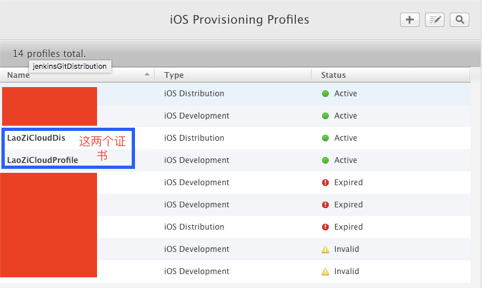

##实现步骤
1. 下载安装Jenkins的MAC版本，下载地址：官网 https://jenkins.io/ ，本手册Jenkins版本为2.46.3，下载完成后进行安装（安装过程略），本手册Xcode版本为8.3.2
2. 安装完成之后，Safari可能会自动打开，如果没有自动打开，打开浏览器，输入http://localhost:8080，如果打开报错，请重新安装Java环境
3. 如果页面打开成功，按照页面给出的提示路径找到/Users/Shared/Jenkins/Home/secrets下的initialAdminPassword文件，复制密码，填入到网页当中。如果不是Jenkins用户进入如下该目录，可能会出现没有权限打开文件，请自行修改该文件的读写权限后再拷贝填入

4. 选择install suggested plugins，安装建议的插件，然后直到重新设置admin user界面，填入用户名及密码等
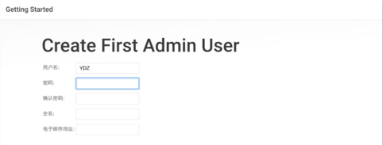
5. 登录localhost:8080 ，选择“系统管理”——“管理插件”，我们要先安装一些辅助插件。
	* 安装GitLab插件：因为我们用的是GitLab来管理源代码，Jenkins本身并没有自带GitLab插件，所以我们需要依次选择 系统管理->管理插件，在“可选插件”中选中“GitLab Plugin”和“Gitlab Hook Plugin”这两项，然后安装。
	* 安装Xcode插件：同安装GitLab插件的步骤一样，我们依次选择系统管理->管理插件，在“可选插件”中选中“Xcode integration”安装。
6. 安装完插件后，创建一个新任务，填入item名，选择“构建一个自由风格的软件项目”，
填入项目名称(自定义)，具体如下图，可选填保持构建的天数，即你构建的项目保持的天数，保持构建的最大数即最多可保持的构建个数
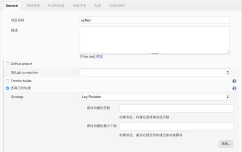
7. 如果需要用到gitLab作为源码管理，需要先配置SSH Key，在Jenkins的证书管理中添加SSH。获取SSH如下：
    * 进入Jenkins用户下：sudo su jenkins，如果没有会创建该用户,按照提示一步步设置该用户密码等即可
    * 生成ssh Key，通过如下命令生成：ssh-keygen -t rsa -C “xxx@mobilereality.org”,其中“xxx@mobilereality.org”为你gitlab账户
    * 将公钥(~/.ssh/id_rsa.pub)内容拷贝到gitlab-profile setting的SSH KEYS字段(可以使用cat ~/.ssh/id_rsa.pub命令显示文件内容然后再拷贝出来)，进入到gitlab当中的Profile settings进入ssh keys，填入刚刚的公钥
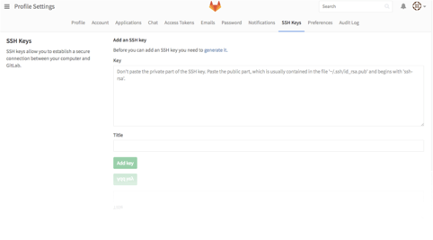
	* id_rsa这个文件内容为私钥，按照第三步同样拷贝出来。在Jenkins管理页面，选择“Credentials”，然后选择“Global credentials (unrestricted)”，点击“Add Credentials”，如下图所示，我们填写自己的SSH信息，然后点击“Save”，这样就把SSH添加到Jenkins的全局域中去了，此处填写的是私钥。
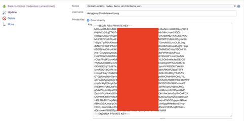

8.	源码管理配置，如果密钥配置成功的话，在填入Repository URL与选择Credentials后，界面会如下，不会产生错误或者警告：

9. 构建触发器： H 10 * * *的意思是每天10点进行编译一次源码，Poll SCM：定时检查源码变更（根据SCM软件的版本号），如果有更新就checkout最新code下来，然后执行构建动作，这里设置为每5分钟检查一次
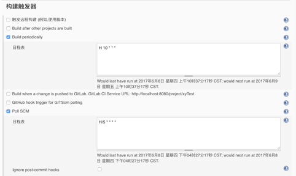
10. 在构建环境之前，首先确保你的证书是有效，需要archive出来的包的相关证书也是与工程相匹配的，否则会出现错误。将 /Users/自己的用户名/Library 文件夹下的 Keychains 和 MobileDevice 复制到 /Users/Shared/Jenkins/Library 文件夹下.(可通过前往文件夹  ~/Library)，如果MobileDevice不存在对应项目的distribution及profile，则需要手动从开发者中心下载下来，并拷贝进去。
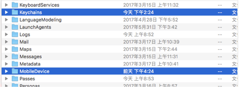
11. 构建环境设置，首先再次添加插件，如之前步骤添加插件：“Keychains and Code Signing Identities”和“Mobile Provisioning Profiles”。完成后，在系统管理页面，选择“Keychains and Provisioning Profiles Management”。然后开始上传login.keychain 和 对用工程的描述文件（在mobileDevice当中）.
	* **注意：高版本Mac系统，默认为login.keychain-db，插件默认不能上传login.keychain-db, 直接重命名为 login.keychain,点击上传.上传结束后进入/Users/Shared/Jenkins/Library/Keychains 目录下,双击运行 login.keychain, 自动变成 login.keychain-db,如果没有双击运行,后续可能访问开发者证书报错)**

	* Code Signing Identity中的内容需要拷贝钥匙串当中相关内容，如下图，拷贝iPhone Distribution.....等填入Code Signing Identity
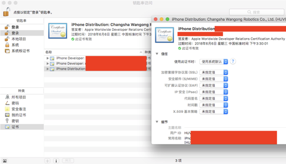
	* 其中Keychains->Filename中内容在login.chain上传成功后会自动填入，Provisioning Profiles中的内容在profile上传成功后会自动填写.
Keychains->Password为loginchain设置的密码
上传完成以后会出现类似如下界面，

	* 配置环境：如下图选择对应即可，不可选择的按照图中一样填写

12. 构建设置：
	* 首先在Jenkins首页进入系统管理->系统设置，添加Apple Development Teams，以为后续步骤做备用。Team name和DevelopmentID在苹果开发者账户当中可以找到（只添加红色框标注的地方）
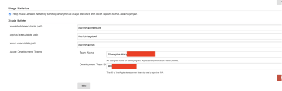
	* target为工程名，需要与对应项目的target一致，configuration表示配置的版本，如果需要导出debug版本则对应进行设置即可

	* ad-hoc表示为内测使用，根据自己生成的证书及选择来进行配置，.ipa filename pattern表示输出的.ipa的名称，Output directory表示输出的.ipa存放位置
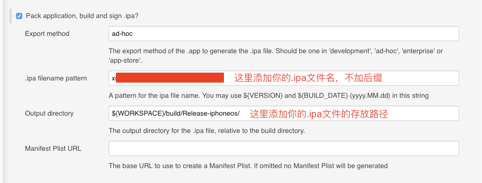	
	* Development Team表示选择开发团队，Keychain path按照如图填写，	Keychain password为你设置的keychain密码，未单独设置为你的开机密码

	* jenkins会在它的目录Home->workspace下建一个文件夹，这个文件夹名字就是你的项目名字（比如你的项目名字叫JenkinsProj，那么会存在Jenkins->Home->workspace->JenkinsProj这个文件夹）。${WORKSPACE}一般都会到Jenkins创建的文件夹下。如果使用了cocoaPods，则需要按照正确的工程文件名及路径填写，具体如下图，涉及到工程文件后缀不需要填写，否则构建时会报找不到对应工程文件。
如果找不到Xcode Schema File,可以先在终端进入工程对应目录下，通过xcodebuild -list命令，你就会得到你的schema列表，找到对应的schema即可。如下图

13. Xcode 设置：
	* 打开工程项目，手动选择证书配置，取消自动选择，选择的描述文件与Jenkins上的设置需要一致：
	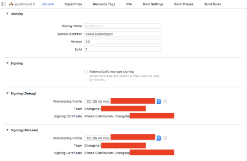
	* scheme错误时将scheme选择shared，打开Xcode->manageSchema，把share勾上
	
14. 运行脚本，将打包好的.ipa文件自动上传到蒲公英
在构建中增加Execute shell，在command中增加如下命令，@${WORKSPACE}/build/Release-iphoneos/${IPANAME}为最终你打包成功后的文件路径，：
IPANAME="XY_JenkinsTest.ipa"
curl -F "file=@${WORKSPACE}/build/Release-iphoneos/${IPANAME}" -F "uKey=你的蒲公英uKEy" -F "_api_key=你的蒲公英_api_key" https://qiniu-storage.pgyer.com/apiv1/app/upload
cd ${WORKSPACE}/apipRobject/XYSendEmail/
python3 sendEmailToTesters.py
	* 注意事项：邮件发送执行的是python脚本，本脚本python版本要求最低为3.6，如果没有安装python请从python官网下载安装，然后请将python脚本拷贝到你的项目的工程目录下，并同步到git
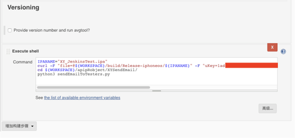
	
##可能出现的错误解决方案
1. 如果出现不能够识别python命令而又确定安装了python，可以尝试按照如下方式配置Jenkins的环境变量：
	* 打开Jenkins—>系统管理—>系统设置—>全局属性—>Environment variables,因为python安装如果是在电脑admin情况下，Jenkins用户中需要添加环境变量，否则会有可能报错找不到命令。
	* 首先在电脑管理员用户情况下执行如下命令：echo $PATH，将展现的内容拷贝，然后粘贴到如下键值对列表栏中，你可以看到python相关内容在其中

	* 如果命令识别成功后出现找不到requests模块，请在终端使用pip3 install requests安装该模块
2. 如果用户下载不了可以考虑这两个问题：
	* 用户的手机iOS系统版本是否低于你APP支持的最低版本
	* 用户手机的UUID是否添加到你的证书当中。如果要某台设备可以安装，则必须要将这台设备的 UDID 添加到导出安装包时所用的证书文件中（. mobileprovision文件），才可以在这台设备上安装